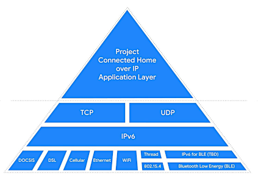

<META NAME="ROBOTS" CONTENT="NOINDEX, NOFOLLOW">

An [Awesome](https://github.com/topics/awesome) List about Energy Control App software and hardware.

.

<!-- omit in toc -->
## Contents
- [Safety](#safety)
- [Engineering](#engineering)
- [Projects](#projects)
- [Solar](#solar)
- [Security](#security)
- [HVAC](#hvac)
- [Manufacturers](#manufacturers)
- [Standards](#standards)
- [Open-Source-Hardware](#open-source-hardware)
- [Open-Source-Software](#open-source-software)

## Safety

- [Safety-Controls](https://en.m.wikipedia.org/wiki/Hierarchy_of_hazard_controls) - Systems to eliminate hazards.

- [COVID-19](https://n-o-d-e.net/covid.html) - Projects to fight SARS-CoV-2.

## Engineering

- [Engineering-Controls](https://en.m.wikipedia.org/wiki/Engineering_controls) - Strategies designed to protect from dangers.

## Projects
  
- [Connected-Home-over-IP](
https://en.m.wikipedia.org/wiki/Connected_Home_over_IP) - CHIP  increases compatibility among different smart home products.

- [BACnet Building Automation Control network](http://www.bacnet.org) - Communication protocols for buildings.

> 

## Solar

- [Solar_power](https://en.m.wikipedia.org/wiki/Solar_power) - Solar power.

## Security

- [RFID](https://en.m.wikipedia.org/wiki/Radio-frequency_identification) - Radio-frequency identification tags.

- [Video-Monitor](https://github.com/ZoneMinder/ZoneMinder/) - CCTV security cameras.

- [Wiegand](https://en.m.wikipedia.org/wiki/Wiegand_interface) - Keycard sensors.
  
## HVAC

- [OpenTherm](https://www.opentherm.eu/) -  An open communication protocol for Heating ventilation and air conditioning.

## Manufacturers

- [Digi](https://en.m.wikipedia.org/wiki/Digi_International) - Industrial Internet of Things manufacturer.

- [Controls-Manufacturers](https://sunbeltcontrols.com/products/building-automation/reliable-controls) - Reliable Controls manufacturer of smart building systems.

- [Building-Automation](https://en.m.wikipedia.org/wiki/Schneider_Electric) - Schneider energy and building automation solutions.

## Standards

- [Canadian-Electrical-Code](https://en.m.wikipedia.org/wiki/Canadian_Electrical_Code) - Canadian Electrical Code.

- [National-Electrical-Code](https://en.m.wikipedia.org/wiki/National_Electrical_Code) - US National Electrical Code.

- [BS7671-IEC60364](https://en.m.wikipedia.org/wiki/BS_7671) - UK and Europe Electrical Codes.

## Open-Source-Hardware

Commercial support and training for open-source hardware (under a model similar to Android) is available for legal, business or government compliance requirements.

See the Wikipedia list of [Open-source_hardware](https://en.m.wikipedia.org/wiki/Open-source_hardware) for more  projects.

<!-- omit in toc -->
### OSHWA.org Association

- [OSHWA.org Association](https://www.oshwa.org/) - OSHWA Open Source Hardware Association.

## Open-Source-Software

Commercial support and professional consulting services are available. Technical expertise and professional DevOps consulting (under a model similar to Red Hat) is available.

See the Wikipedia [List_of_commercial_open-source_applications_and_services](https://en.m.wikipedia.org/wiki/List_of_commercial_open-source_applications_and_services) for more projects.

<!-- omit in toc -->
### OpenHAB

- [OpenHAB](https://github.com/openhab/openhab-docs) - Vendor agnostic automation.

<!-- omit in toc -->
### Home-Assistant

- [Home-Assistant](https://github.com/home-assistant) - Automation software for tinkerers and DIY enthusiasts.

<!-- omit in toc -->
### Iotivity

- [Iotivity](https://gitlab.iotivity.org/iotivity/iotivity-lite/) - The Open Connectivity Foundation Core Framework for IoT.

----

<META NAME="ROBOTS" CONTENT="NOINDEX, NOFOLLOW">

<!-- omit in toc -->
## How to report a vulnerability

If you believe you have discovered a security issue related to this site, please email us with a full description of the vulnerability. We ask that you please keep the details private until we have had a chance to resolve the issue.

<!-- omit in toc -->
## Notification

The team will coordinate public notification of the vulnerability with you. To protect users, we ask that you do not share details of the vulnerability with the public until we have had time to research and address the issue.

<!-- omit in toc -->
## Disclosure

Please do not discuss security vulnerabilities in public until a fix has been developed and deployed.

Also see [SECURITY.md](./SECURITY.md) about reporting security issues and vulnerabilities.

----

<META NAME="ROBOTS" CONTENT="NOINDEX, NOFOLLOW">

<!-- omit in toc -->
## Awesome-FLOSS

A GitHub repository about [Awesome-FLOSS](https://github.com/sindresorhus/awesome) - Free, Libre and Open-Source Software.

<!-- omit in toc -->
### Electronic-Circuits

- [Awesome-circuits](https://github.com/Xndr7/awesome-circuits) - Electronic circuits and components.

- [Awesome-electronics](https://github.com/kitspace/awesome-electronics) - Electronic CAD software.

- [Awesome-electronic-engineering](https://github.com/SergioGasquez/awesome-electronic-engineering) - Electronic Engineering Learning repository.

- [Awesome-electronics](https://github.com/techgaun/awesome-electronics) - Electronics circuits.

<!-- omit in toc -->
### Physical-Security

- [Awesome-PhySec](https://github.com/l373/Awesome-PhySec) - PhySec, Physical-Security.

<!-- omit in toc -->
### Energy-Storage

- [Energy-Storage](https://github.com/protontypes/open-sustainable-technology) - Sustainable technology for Energy-Storage and battery management.

----

.