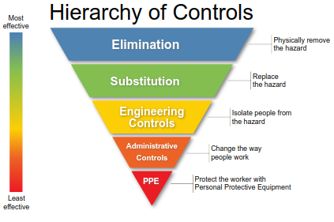
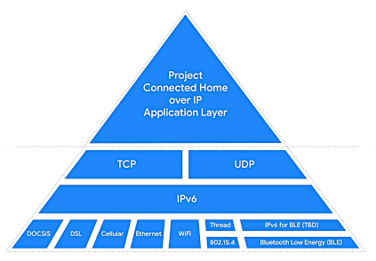

<META NAME="ROBOTS" CONTENT="NOINDEX, NOFOLLOW">

<!-- omit in toc -->
# EnergyControlApp

<!-- omit in toc -->
## Awesome-List 

Just the best, carefully curated set of [Awesome-Lists](https://github.com/topics/awesome) about [**EnergyControlApp**](https://energycontrolapp.github.io) resources to **control energy** in some way, shape or form.

<!-- omit in toc -->
## Contents
- [Safety](#safety)
- [Controls](#controls)
- [Protection](#protection)
- [Projects](#projects)
- [Security](#security)
- [Alarms](#alarms)
- [HVAC](#hvac)
- [Electronics](#electronics)
- [Manufacturers](#manufacturers)
- [Engineering](#engineering)
- [Standards](#standards)
- [Open Source Hardware](#open-source-hardware)
  - [OSHWA Open Source Hardware Association](#oshwa-open-source-hardware-association)
- [Open Source Software](#open-source-software)
  - [Apache-OFbiz](#apache-ofbiz)
- [Awesome-EnergyControlApp Awesome-FLOSS](#awesome-energycontrolapp-awesome-floss)

## Safety

- [Controls](https://en.m.wikipedia.org/wiki/Hierarchy_of_hazard_controls) - Hierarchy of Controls to safely manage hazards.

- [NIOSH-air-filtration](https://en.m.wikipedia.org/wiki/NIOSH_air_filtration_rating) - Air filtration respirators.
  
- [COVID-19](https://n-o-d-e.net/covid.html) - A showcase of open hardware projects to fight COVID-19.

## Controls

- [Engineering-Controls](https://en.m.wikipedia.org/wiki/Engineering_controls) - Controls designed to protect.

## Protection

- [Electrical-Protection](https://en.m.wikipedia.org/wiki/Power_system_protection) - Protection of electrical power systems from faults.

- [Hazard-Elimination](https://en.m.wikipedia.org/wiki/Hazard_elimination) - Protection of electrical power systems from faults.

- [PtD-Prevention](https://en.m.wikipedia.org/wiki/Prevention_through_design) - Prevention through Design.

## Projects

- [CHIP-Connected-Home-over-IP](
https://en.m.wikipedia.org/wiki/Connected_Home_over_IP) - CHIP Project Connected Home over IP is an open-source, royalty-free  automation connectivity standards project which features compatibility among different smart home and Internet of Things products and software.

- [BACnet Building Automation Control network](http://www.bacnet.org) - ANSI ISO Standard Communication Protocol for buildings.

## Security

- [RFID](https://github.com/rfidtool/ESP-RFID-Tool) - Wiegand RFID testing.
  
## Alarms

- [Fire-Alarms](https://en.m.wikipedia.org/wiki/Fire_alarm_system) - Fire alarm systems.

## HVAC

- [HVAC](https://en.m.wikipedia.org/wiki/Heating,_ventilation,_and_air_conditioning) - Heating ventilation and air conditioning.

## Electronics

- [Digi](https://en.m.wikipedia.org/wiki/Digi_International) - Digi Industrial Internet of Things.

- [Energy-Star](https://en.m.wikipedia.org/wiki/Energy_Star) - Certified energy-efficient products.

## Manufacturers

- [Controls-Manufacturers](https://sunbeltcontrols.com/products/building-automation/reliable-controls) - Reliable Controls manufacturer of smart building controls.

- [Building-Automation-Solutions](https://en.m.wikipedia.org/wiki/Schneider_Electric) - Schneider energy and building automation solutions.

## Engineering

- [HPAC-Engineering](https://www.hpac.com/magazine) - HVAC and Building Automation Systems magazine.

## Standards

- [Canadian-Electrical-Code](https://en.m.wikipedia.org/wiki/Canadian_Electrical_Code) - Canadian Electrical Code.

## Open Source Hardware

### OSHWA Open Source Hardware Association

- [OSHWA-Open-Source-Hardware](https://www.oshwa.org/) - OSHWA Open Source Hardware Association.

> Commercial support and training for open-source hardware (under a model similar to Android) is available for legal, business or government compliance requirements. Commercial licences can offer legal indemnification from copyright and patent infringement claims.

See the Wikipedia list of [Open-source_hardware](https://en.m.wikipedia.org/wiki/Open-source_hardware) for other good examples of open-source hardware projects.

## Open Source Software

### Apache-OFbiz

- [Apache-OFbiz](https://ofbiz.apache.org) - Open Source Enterprise Resource Planning.

> Commercial support and professional consulting services are available. Technical expertise and professional DevOps consulting (under a model similar to Red Hat) is available.

See the Wikipedia [List_of_commercial_open-source_applications_and_services](https://en.m.wikipedia.org/wiki/List_of_commercial_open-source_applications_and_services) for other services, projects and applications.

----

<META NAME="ROBOTS" CONTENT="NOINDEX, NOFOLLOW">

> (This list is not to be used or interpreted as an advertisement for the vendors listed.)

## Awesome-EnergyControlApp Awesome-FLOSS

The [awesome-energycontrolapp](https://github.com/energycontrolapp/awesome-energycontrolapp) repository features the best [Awesome-FLOSS](https://github.com/sindresorhus/awesome) - Free, Libre and Open-Source Software and hardware that **control energy** in some way. 

<!-- omit in toc -->
### Open-Source?

- [Open-Source](https://en.m.wikipedia.org/wiki/Open-source_software) - What is Open-Source?

- [GitHub-Open-Source](https://github.com/open-source) - Open-Source on GitHub.

<!-- omit in toc -->
### Programming-Languages

- [Rust-Lang.org](https://www.rust-lang.org/) - The awesome Rust Programming Language.

- [Awesome-embedded-rust](https://github.com/rust-embedded/awesome-embedded-rust) - Embedded Rust.

- [Awesome-rust](https://github.com/rust-unofficial/awesome-rust) - Unofficial Rust resources.

<!-- omit in toc -->
### Electronic-Circuits

- [Awesome-circuits](https://github.com/Xndr7/awesome-circuits) - Electronic circuits and components.

- [Awesome-electronics](https://github.com/kitspace/awesome-electronics) - Electronic CAD software.

- [Awesome-electronic-engineering](https://github.com/SergioGasquez/awesome-electronic-engineering) - Electronic Engineering Learning repository.

- [Awesome-electronics](https://github.com/techgaun/awesome-electronics) - DIY electronics circuits.

<!-- omit in toc -->
### Physical-Security

- [Awesome-PhySec](https://github.com/l373/Awesome-PhySec) - PhySec, Physical-Security.

<!-- omit in toc -->
### Energy-Storage

- [Energy-Storage](https://github.com/protontypes/open-sustainable-technology) - Sustainable technology for Energy-Storage and battery management.